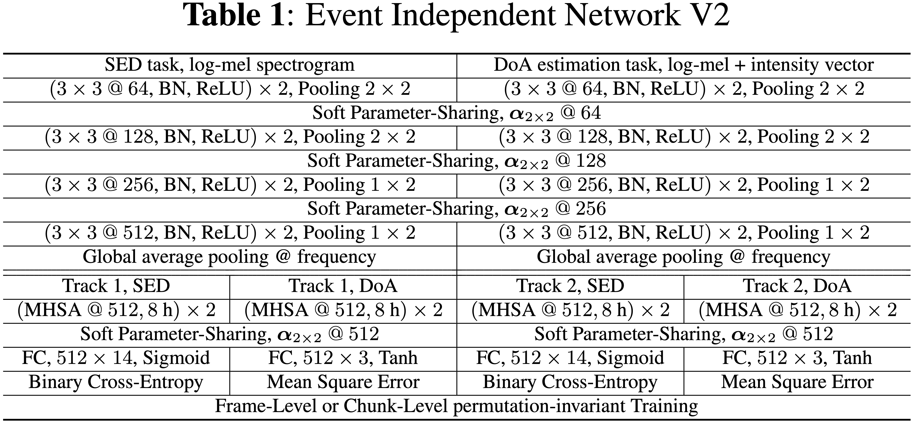

# An Improved Event-Independent Network for Polyphonic Sound Event Localization and Detection
An Improved Event-Independent Network (EIN) for Polyphonic Sound Event Localization and Detection (SELD)

from Centre for Vision, Speech and Signal Processing, University of Surrey.

## Contents

- [Introduction](#Introduction)
- [Requirements](#Requirements)
- [Download Dataset](#Download-Dataset)
- [Preprocessing](#Preprocessing)
- [QuickEvaluate](#QuickEvaluate)
- [Usage](#Usage)
  * [Training](#Training)
  * [Prediction](#Prediction)
  * [Evaluation](#Evaluation)
- [Results](#Results)
- [FAQs](#FAQs)
- [Citing](#Citing)
- [Reference](#Reference)


## Introduction

This is a Pytorch implementation of Event-Independent Networks for Polyphonic SELD. 

Event-Independent Networks for Polyphonic SELD uses a trackwise output format and multi-task learning (MTL) of a soft parameter-sharing scheme. For more information, please read papers [here](#Citing).

 <!-- [*An Improved Event-Independent Network for Polyphonic Sound Event Localization and Detection*](https://arxiv.org/abs/2010.13092), and [*Event-Independent Network for Polyphonic Sound Event Localization and Detection*](https://arxiv.org/abs/2010.00140).  -->

The features of this method are:
- It uses a trackwise output format to detect different sound events of the same type but with different DoAs.
- It uses a permutation-invaiant training (PIT) to solve the track permutation problem introducted by trackwise output format.
- It uses multi-head self-attention (MHSA) to separate tracks.
- It uses multi-task learning (MTL) of a soft parameter-sharing scheme for joint-SELD.

Currently, the code is availabel for [*TAU-NIGENS Spatial Sound Events 2020*](http://dcase.community/challenge2020/task-sound-event-localization-and-detection#download) dataset. Data augmentation methods are not included.

## Requirements

We provide two ways to setup the environment. Both are based on [Anaconda](https://www.anaconda.com/products/individual).

1. Use the provided `prepare_env.sh`. Note that you need to set the `anaconda_dir` in `prepare_env.sh` to your anaconda directory, then directly run

    ```bash
    bash scripts/prepare_env.sh
    ```

2. Use the provided `environment.yml`. Note that you also need to set the `prefix` to your aimed env directory, then directly run

    ```bash
    conda env create -f environment.yml
    ```
    
After setup your environment, don't forget to activate it

```bash
conda activate ein
```

## Download Dataset

Download dataset is easy. Directly run

```bash
bash scripts/download_dataset.sh
```

## Preprocessing

It is needed to preprocess the data and meta files. `.wav` files will be saved to `.h5` files. Meta files will also be converted to `.h5` files. After downloading the data, directly run

```bash
bash scripts/preproc.sh
```

Preprocessing for meta files (labels) separate labels to different tracks, each with up to one event and a corresponding DoA. The same event is consistently put in the same track. For frame-level permutation-invariant training, this may not be necessary, but for chunk-level PIT or no PIT, consistently arrange the same event in the same track is reasonable.

## QuickEvaluate

We uploaded the pre-trained model here. Download it and unzip it in the code folder (`EIN-SELD` folder) using

```bash
wget 'https://zenodo.org/record/4158864/files/out_train.zip' && unzip out_train.zip
```

Then directly run

```bash
bash scripts/predict.sh && sh scripts/evaluate.sh
```

## Usage

Hyper-parameters are stored in `./configs/ein_seld/seld.yaml`. You can change some of them, such as `train_chunklen_sec`, `train_hoplen_sec`, `test_chunklen_sec`, `test_hoplen_sec`, `batch_size`, `lr` and others.

### Training

To train a model yourself, setup `./configs/ein_seld/seld.yaml` and directly run

```bash
bash scripts/train.sh
```

`train_fold` and `valid_fold` in `./configs/ein_seld/seld.yaml` means using what folds to train and validate. Note that `valid_fold` can be `None` which means no validation is needed, and this is usually used for training using fold 1-6.

`overlap` can be  `1` or `2` or combined `1&2`, which means using non-overlapped sound event to train or overlapped to train or both.

`--seed` is set to a random integer by default. You can set it to a fixed number. Results will not be completely the same if RNN or Transformer is used.

You can consider to add `--read_into_mem` argument in `train.sh` to pre-load all of the data into memory to increase the training speed, according to your resources. 

`--num_workers` also affects the training speed, adjust it according to your resources.

### Prediction

Prediction predicts resutls and save to `./out_infer` folder. The saved results is the submission result for DCASE challenge. Directly run

```bash
bash scripts/predict.sh
```

Prediction predicts results on `testset_type` set, which can be `dev` or `eval`. If it is `dev`, `test_fold` cannot be `None`.


### Evaluation

Evaluation evaluate the generated submission result. Directly run

```bash
bash scripts/evaluate.sh
```

## Results

It is notable that EINV2-DA is a single model with plain VGGish architecture using only the channel-rotation and the specaug data-augmentation methods.



## FAQs

1. If you have any question, please email to caoyfive@gmail.com or report an issue here.

2. Currently the `pin_memory` can only be set to `True`. For more information, please check [Pytorch Doc](https://pytorch.org/docs/stable/data.html#memory-pinning) and [Nvidia Developer Blog](https://developer.nvidia.com/blog/how-optimize-data-transfers-cuda-cc/).

3. After downloading, you can delete `downloaded_packages` folder to save some space.

## Citing

If you use the code, please consider citing the papers below

[[1]. Yin Cao, Turab Iqbal, Qiuqiang Kong, Fengyan An, Wenwu Wang, Mark D. Plumbley, "*An Improved Event-Independent Network for Polyphonic Sound Event Localization and Detection*", submitted for publication](http://bit.ly/2N8cF6w)
```
@article{cao2020anevent,
  title={An Improved Event-Independent Network for Polyphonic Sound Event Localization and Detection},
  author={Cao, Yin and Iqbal, Turab and Kong, Qiuqiang and Fengyan, An and Wang, Wenwu and Plumbley, Mark D},
  journal={arXiv preprint arXiv:2010.13092},
  year={2020}
}
```

[[2]. Yin Cao, Turab Iqbal, Qiuqiang Kong, Yue Zhong, Wenwu Wang, Mark D. Plumbley, "*Event-Independent Network for Polyphonic Sound Event Localization and Detection*", DCASE 2020 Workshop, November 2020](https://bit.ly/2Tz8oJ9)
```
@article{cao2020event,
  title={Event-Independent Network for Polyphonic Sound Event Localization and Detection},
  author={Cao, Yin and Iqbal, Turab and Kong, Qiuqiang and Zhong, Yue and Wang, Wenwu and Plumbley, Mark D},
  journal={arXiv preprint arXiv:2010.00140},
  year={2020}
}
```

## Reference

1. Archontis Politis, Sharath Adavanne, and Tuomas Virtanen. A dataset of reverberant spatial sound scenes with moving sources for sound event localization and detection. In Proceedings of the Workshop on Detection and Classification of Acoustic Scenes and Events (DCASE2020). November 2020. [URL](https://arxiv.org/abs/2006.01919)

2. Annamaria Mesaros, Sharath Adavanne, Archontis Politis, Toni Heittola, and Tuomas Virtanen. Joint measurement of localization and detection of sound events. In IEEE Workshop on Applications of Signal Processing to Audio and Acoustics (WASPAA). New Paltz, NY, Oct 2019. [URL](https://ieeexplore.ieee.org/abstract/document/8937220?casa_token=Z4aGA4E2Dz4AAAAA:BELmzMjaZslLDf1EN1NVZ92_9J0PRnRymY360j--954Un9jb_WXbvLSDhp--7yOeXp0HXYoKuUek)

3. Sharath Adavanne, Archontis Politis, Joonas Nikunen, and Tuomas Virtanen. Sound event localization and detection of overlapping sources using convolutional recurrent neural networks. IEEE Journal of Selected Topics in Signal Processing, 13(1):34–48, March 2018. [URL](https://ieeexplore.ieee.org/abstract/document/8567942)

4. https://github.com/yinkalario/DCASE2019-TASK3

